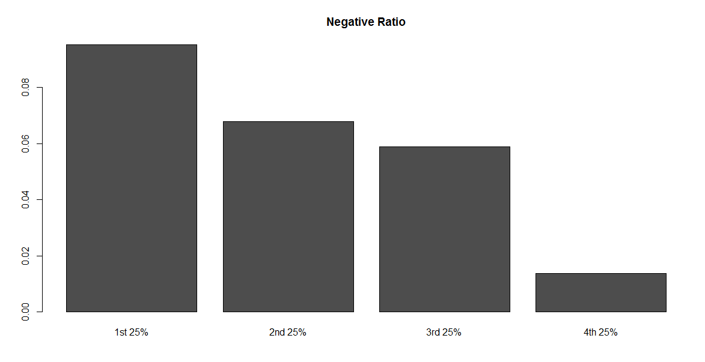
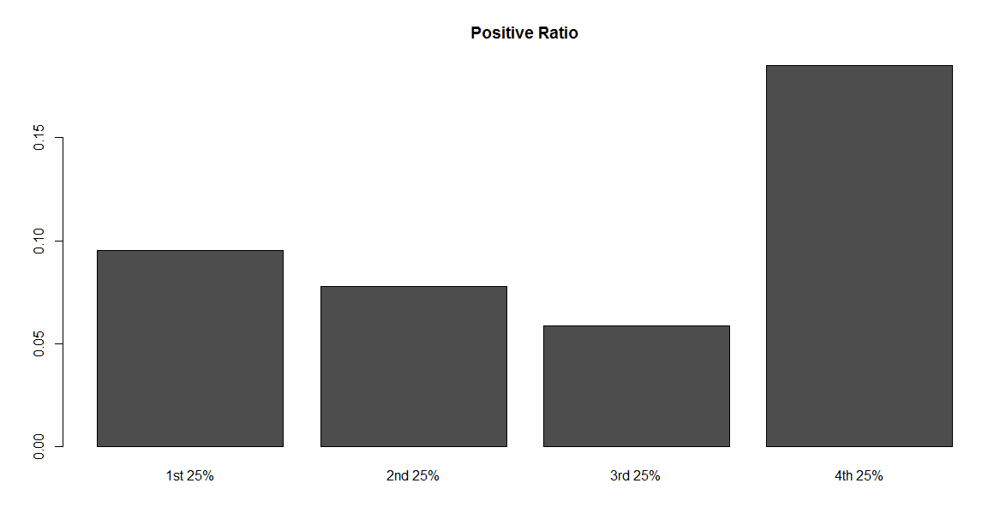

---

# Instructions
Conduct sentiment analysis on MLK's speech to determine how positive/negative his speech was. Split his speech into four quartiles to see how that sentiment changes over time.Create two bar charts to display your results.

---

```{r setup, message = FALSE}
# Add your library below.

library(XML)
library(tidyverse)
library(tm)

```

# Step 1 - Read in the positive and negative word files

## Step 1.1 - Find the files
Find two files (one for positive words and one for negative words) from the UIC
website. These files are about halfway down the page, listed as “A list of 
English positive and negative opinion words or sentiment words”. Use the link 
below:

* http://www.cs.uic.edu/~liub/FBS/sentiment-analysis.html  

Save these files in your "data" folder. 

```{r, "Step 1.1"}
# No code necessary; Save the files in your project's data folder.
```

## Step 1.2 - Create vectors
Create two vectors of words, one for the positive words and one for the 
negative words.

```{r, "Step 1.2"}
# Write your code below.

pos <- "data/pos-words.txt"
neg <- "data/neg-words.txt"
p <- scan(pos, character(0), sep="\n")
n <- scan(neg, character(0), sep="\n")
head(p, 50)
head(n, 50)

```

## Step 1.3 - Clean the files
Note that when reading in the word files, there might be lines at the start 
and/or the end that will need to be removed (i.e. you should clean your dataset).

```{r, "Step 1.3"}
# Write your code below.

p <- p[-1:-29]
n <- n[-1:-30]
head(p, 50)
head(n, 50)

```


---


# Step 2: Process in the MLK speech

## Step 2.1 - Find and read in the file.
Find MLK's speech on the AnalyticTech website. Use the link below:

* http://www.analytictech.com/mb021/mlk.htm  

Read in the file using the XML package. 
Otherwise, cut and paste the document into a .txt file.

```{r, "Step 2.1"}
# Write your code below.

mlkLocation <- URLencode("http://www.analytictech.com/mb021/mlk.htm")

```

## Step 2.2 - Parse the files
If you parse the html file using the XML package, the following code might help:

```
# Read and parse HTML file

doc.html = htmlTreeParse('http://www.analytictech.com/mb021/mlk.htm', 
                         useInternal = TRUE)

# Extract all the paragraphs (HTML tag is p, starting at
# the root of the document). Unlist flattens the list to
# create a character vector.

doc.text = unlist(xpathApply(doc.html, '//p', xmlValue))

# Replace all \n by spaces
doc.text = gsub('\\n', ' ', doc.text)

# Replace all \r by spaces
doc.text = gsub('\\r', ' ', doc.text)
```

```{r, "Step 2.2"}
# Write your code below, if necessary.

doc.html = htmlTreeParse(mlkLocation, useInternal = TRUE)
mlk = unlist(xpathApply(doc.html, '//p', xmlValue))
mlk = gsub('\\n', '', mlk)
mlk = gsub('\\r', ' ', mlk)

```

## Step 2.3 - Create a term matrix
Create a term matrix.

```{r, "Step 2.3"}
# Write your code below.

words.vec <- VectorSource(mlk)
words.corpus <- Corpus(words.vec)
words.corpus

words.corpus <- tm_map(words.corpus, content_transformer(tolower))
words.corpus <- tm_map(words.corpus, removePunctuation)
words.corpus <- tm_map(words.corpus, removeNumbers)
words.corpus <- tm_map(words.corpus, removeWords, stopwords("english"))
words.corpus

tdm <- TermDocumentMatrix(words.corpus)
mlkMatrix <- as.matrix(tdm)

```
## Step 2.4 - Create a list
Create a list of counts for each word.

```{r, "Step 2.4"}
# Write your code below.

wordCounts <- rowSums(mlkMatrix)
wordCounts <- sort(wordCounts, decreasing=TRUE)
head(wordCounts)

mlkWordcount <- length(wordCounts)

```

---

# Step 3: Positive words
Determine how many positive words were in the speech. Scale the number based on 
the total number of words in the speech. 
**Hint:** 
One way to do this is to use `match()` and then `which()`.

```{r, "Step 3"}
# Write your code below.

words <- names(wordCounts)
matchedpWords <- match(words, p, nomatch=0)
mpCounts <- matchedpWords[which(matchedpWords!=0)]
totalPos <- length(mpCounts)

totalPos

totalPos / mlkWordcount

```

---

# Step 4: Negative words
Determine how many negative words were in the speech. Scale the number based on the total number of words in the speech.  
**Hint:** This is basically the same as Step 3.

```{r, , "Step 4"}
# Write your code below.

wordsNeg <- names(wordCounts)
matchednWords <- match(wordsNeg, n, nomatch=0)
mnCounts <- matchednWords[which(matchednWords!=0)]
totalNeg <- length(mnCounts)

totalNeg

totalNeg / mlkWordcount

```

---

# Step 5: Get Quartile values
Redo the “positive” and “negative” calculations for each 25% of the speech by
following the steps below.

## 5.1 Compare the results in a graph
Compare the results (e.g., a simple bar chart of the 4 numbers).  
For each quarter of the text, you calculate the positive and negative ratio, 
as was done in Step 4 and Step 5.  
The only extra work is to split the text to four equal parts, then 
visualize the positive and negative ratios by plotting. 

The final graphs should look like below:  



**HINT:** 
The code below shows how to start the first 25% of the speech.
Finish the analysis and use the same approach for the rest of the speech.

```
# Step 5: Redo the positive and negative calculations for each 25% of the speech
  # define a cutpoint to split the document into 4 parts; round the number to get an interger
  cutpoint <- round(length(words.corpus)/4)
 
# first 25%
  # create word corpus for the first quarter using cutpoints
  words.corpus1 <- words.corpus[1:cutpoint]
  # create term document matrix for the first quarter
  tdm1 <- TermDocumentMatrix(words.corpus1)
  # convert tdm1 into a matrix called "m1"
  m1 <- as.matrix(tdm1)
  # create a list of word counts for the first quarter and sort the list
  wordCounts1 <- rowSums(m1)
  wordCounts1 <- sort(wordCounts1, decreasing=TRUE)
  # calculate total words of the first 25%
```

```{r}
# Write your code below.

# Step 5: Redo the positive and negative calculations for each 25% of the speech
  # define a cutpoint to split the document into 4 parts; round the number to get an interger
  cutpoint <- round(length(words.corpus)/4)
 
# First 25%
words.corpus1 <- words.corpus[1:cutpoint]
tdm1 <- TermDocumentMatrix(words.corpus1)
m1 <- as.matrix(tdm1)
wordCounts1 <- rowSums(m1)
wordCounts1 <- sort(wordCounts1, decreasing=TRUE)
length(wordCounts1)

# Positive
words1 <- names(wordCounts1)
matchedpWords1 <- match(words1, p, nomatch=0)
mpCounts1 <- matchedpWords1[which(matchedpWords1!=0)]
totalPos1 <- length(mpCounts1)
Q1P <- totalPos1 / length(wordCounts1)

# Negative
wordsNeg1 <- names(wordCounts1)
matchednWords1 <- match(wordsNeg1, n, nomatch=0)
mnCounts1 <- matchednWords1[which(matchednWords1!=0)]
totalNeg1 <- length(mnCounts1)
Q1N <- totalNeg1 / length(wordCounts1)


# Second 25%
words.corpus2 <- words.corpus[cutpoint+1:cutpoint*2]
tdm2 <- TermDocumentMatrix(words.corpus2)
m2 <- as.matrix(tdm2)
wordCounts2 <- rowSums(m2)
wordCounts2 <- sort(wordCounts2, decreasing=TRUE)
length(wordCounts2)

# Positive
words2 <- names(wordCounts2)
matchedpWords2 <- match(words2, p, nomatch=0)
mpCounts2 <- matchedpWords2[which(matchedpWords2!=0)]
totalPos2 <- length(mpCounts2)
Q2P <- totalPos2 / length(wordCounts2)

# Negative
wordsNeg2 <- names(wordCounts2)
matchednWords2 <- match(wordsNeg2, n, nomatch=0)
mnCounts2 <- matchednWords2[which(matchednWords2!=0)]
totalNeg2 <- length(mnCounts2)
Q2N <- totalNeg2 / length(wordCounts2)


# Third 25%
words.corpus3 <- words.corpus[cutpoint*2+1:cutpoint*3]
tdm3 <- TermDocumentMatrix(words.corpus3)
m3 <- as.matrix(tdm3)
wordCounts3 <- rowSums(m3)
wordCounts3 <- sort(wordCounts3, decreasing=TRUE)
length(wordCounts3)

# Positive
words3 <- names(wordCounts3)
matchedpWords3 <- match(words3, p, nomatch=0)
mpCounts3 <- matchedpWords3[which(matchedpWords3!=0)]
totalPos3 <- length(mpCounts3)
Q3P <- totalPos3 / length(wordCounts3)

# Negative
wordsNeg3 <- names(wordCounts3)
matchednWords3 <- match(wordsNeg3, n, nomatch=0)
mnCounts3 <- matchednWords3[which(matchednWords3!=0)]
totalNeg3 <- length(mnCounts3)
Q3N <- totalNeg3 / length(wordCounts3)


# Fourth 25%
words.corpus4 <- words.corpus[cutpoint*3+1:cutpoint*4]
tdm4 <- TermDocumentMatrix(words.corpus4)
m4 <- as.matrix(tdm4)
wordCounts4 <- rowSums(m4)
wordCounts4 <- sort(wordCounts4, decreasing=TRUE)
length(wordCounts4)

# Positive
words4 <- names(wordCounts4)
matchedpWords4 <- match(words4, p, nomatch=0)
mpCounts4 <- matchedpWords4[which(matchedpWords4!=0)]
totalPos4 <- length(mpCounts4)
Q4P <- totalPos4 / length(wordCounts4)

# Negative
wordsNeg4 <- names(wordCounts4)
matchednWords4 <- match(wordsNeg4, n, nomatch=0)
mnCounts4 <- matchednWords4[which(matchednWords4!=0)]
totalNeg4 <- length(mnCounts4)
Q4N <- totalNeg4 / length(wordCounts4)


# Graphing
qPos <- c(Q1P, Q2P, Q3P, Q4P)
qNeg <- c(Q1N, Q2N, Q3N, Q4N)
df <- data.frame(qPos, qNeg)
df$Qs <- c("Q1", "Q2", "Q3", "Q4")

# Positive Graphing
ggplot(df, aes(x=Qs, y=qPos)) +
  geom_col() +
  labs(title = "Positive Ratio")

# Negative Graphing
ggplot(df, aes(x=Qs, y=qNeg)) +
  geom_col() +
  labs(title = "Negative Ratio")

```

# 5.2 Analysis

What do you see from the positive/negative ratio in the graph? 
State what you learned from the MLK speech using the sentiment analysis results: 


> The positive graph shows that the speech started very positive, spiked to lowest,  and slowly increased. The negative graph shows that the speech started very negative and then decreased. These results may imply that the speech started controversial, became negative, and ended positive.  

